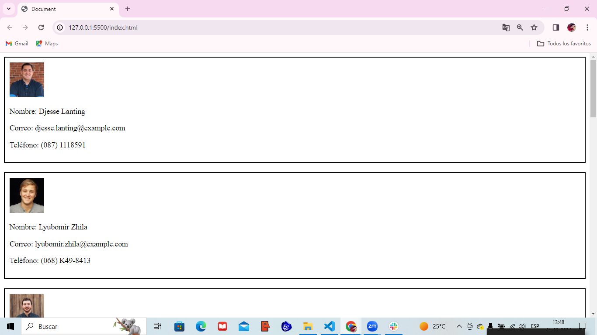

# Desafío - Datos de usuarios

Desafío - Datos de usuarios del módulo 4 Programación avanzada en JavaScript de la beca Desarrollo de aplicaciones Full Stack Javascript Trainee dictado por Desafío Latam. Los requisitos del proyecto son los siguientes:
Requerimientos

1. Programar una función IIFE para ser invocada al cargar nuestra página.
(5 Puntos)
2. Programar la petición a la API usando async - await y mostrar el resultado en html
utilizando etiquetas del tipo párrafo una bajo la otra.
(5 Puntos)

## Descripción

Descripción
En desarrollo web es muy importante trabajar consumiendo datos desde diversas fuentes,
entre ellas APIs, también podemos utilizar patrones para desarrollar, cómo el patrón de
módulo.
En este desafío utilizarás datos desde la siguiente URL, la cual nos devuelve un arreglo con
usuarios de forma aleatoria, específicamente consumirás los datos desde la siguiente API, la
cual nos devuelve 10 usuarios y aplicarás el patrón módulo como forma de trabajo.
Al cargar nuestra página, debe realizar la petición y mostrar la información, como en la
siguiente imagen de muestra



## Empezando 🚀

Estas instrucciones te guiarán para obtener una copia de este proyecto en funcionamiento en tu máquina local para propósitos de desarrollo y pruebas.

```bash
git clone url-github
```

### Prerrequisitos 📋

Lista de software y herramientas, incluyendo versiones, que necesitas para instalar y ejecutar este proyecto:

- Sistema Operativo (por ejemplo, Ubuntu 20.04, Windows 10, MacOS 10.15)
- Navegador (Firefox, Chrome, Safari)
